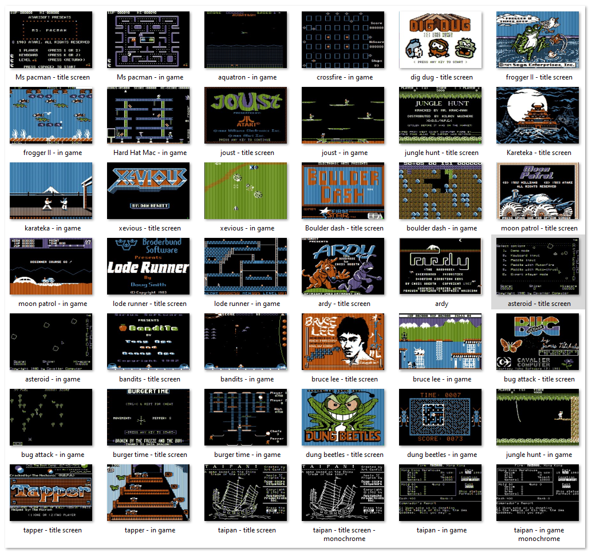

# REINETTE II PLUS DOT PY

Jerôme - What ? another reinette ?  
Arthur - Yes, but this time I wrote it in python    

J - You're kidding me ? An apple II plus computer emulator in python ?  
A - Yes, why not ?  

J - Well, python is sooo slooooow  
A - It is not that slow - and here is one evidence : a playable Apple 2 emulator  

J - You had to remove a lot of features achieve it ?  
A - Nope, it has the language card, supports all video modes, speaker, joystick and emulates the disk II drive  
 
J - I can't believe - does it support games ?  
A - Yes, it uses the SDL2 library for video and sound  

J - How can I test it ?  
A - Well, you just need python 3 and run **pip install pySDL2** to install the graphics library  
    Then, open a terminal and type : **python reinetteII+.py**  
    On windows, you can rename 'reinetteII+.py' to 'reinetteII+.pyw' and double click on it to launch it from explorer  

J - Well, I have a dark screen with Apple II printed on top, what's next ?  
A - This is how the apple II plus starts - you can press reset (F11) to get to the APPLESOFT prompt or drag and drop a floppy image (.nib only) and wait it loads the programm from floppy.  

J - Jeez, that's pretty neat !  
A - I Hope you won't spend all your time playing ... I wrote it for you to read it - I spent a lot commenting the code.  

J - Yeah, yeah, one more play please - how do I use the stick ?  
A - Press F1 to get help  

J - Screenshots ? it can take screenshots ?  
A - Yes, look :   



J - That's wonderfull, I see I can adjust the FPS ?  
A - Yep, that part is still experimental - you should'nt need it, unless you experience slow frame rates.  
    Did you noticed you can resize the screen ?  

J - Yes, I prefer the x2 size on my laptop, I have a note pad on the left to write APPLESOFT programs and I copy and paste (F3) them on the emulator.  
A - yes, that's exactly how it is meant to be used - enjoy !  


## In summary,

Get python, then install pySDL2 
```
pip install pySDL2
```
and run the emulator using :
```
python3 reinetteII+.py <optional nib file>
```
Then, drag'n'drop a .nib file to *insert a floppy in the drive* or press reset (F11) to get to the APPLESOFT prompt


| key  | action                             |
|------|------------------------------------|
| F1   | help screen                        | 
| F2   | take a screenshot                  | 
| F3   | paste text from clipboard          | 
| F4   | mute / unmute sound                | 
| F5   | toggle monochrome (in HGR only)    | 
| F6   | decrease window size down to 1:1   | 
| F7   | increase window size up to 8:1     | 
| F8   | decrease target FPS                | 
| F9   | increase target FPS                | 
| F10  | toggle pause                       | 
| F11  | here is your RESET key             | 
| F12  | power cycle                        | 


Joystick is emulated using the 1,2,3 and 5 keys on the numpad and CTRL and ALT for the buttons  


**Please start it if you like. Cheers**
