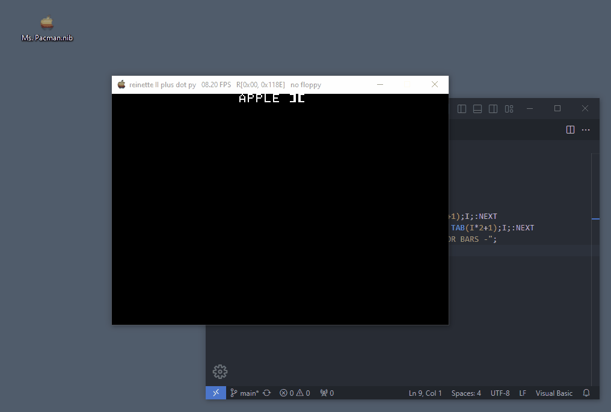

# REINETTE II PLUS DOT PY

An easy to use, yet efficient, Apple II plus emulator in python


  
  
Copy an applesoft program and paste it using F3.   
Drag'n drop a floppy image will make the computer load it.  
The title bar shows :
- The frame rate
- If active, the drive head position (track/nibble) with R/W indicating if reading or writting  
- The name of the floppy if one has been loaded.  


## Features

- Language Card (64KB of RAM)
- All video modes at 60 fps
- window resize by integer factors
- Single key screenshots
- disk ][
- Drag'n drop floppy image files (.nib format only)
- Joysitck
- Sound
- etc...

Uses the **SDL2** library


## installation and execution

Get python, then install pySDL2 :   
```
pip install pySDL2 pysdl2-dll
```  
and run the emulator using :  
```
python3 reinetteII+.py
```  
Then, drag'n'drop a .nib file to *insert a floppy into the drive* or press reset (F11) to get to the APPLESOFT prompt  


## Controls

All emulator controls are performed using the functions keys :

| key  | action                             |
|------|------------------------------------|
| F1   | help screen                        | 
| F2   | take a screenshot                  | 
| F3   | paste text from clipboard          | 
| F4   | mute / unmute sound                | 
| F5   | toggle monochrome (in HGR only)    | 
| F6   | decrease window size down to 1:1   | 
| F7   | increase window size up to 8:1     | 
| F8   | decrease desired FPS               | 
| F9   | increase desired FPS               | 
| F10  | toggle pause                       | 
| F11  | RESET                              | 
| F12  | power cycle                        | 


Joystick is emulated using the 1,2,3 and 5 keys on the numpad and CTRL and ALT for the buttons    


**Please star it if you like. Cheers**  
